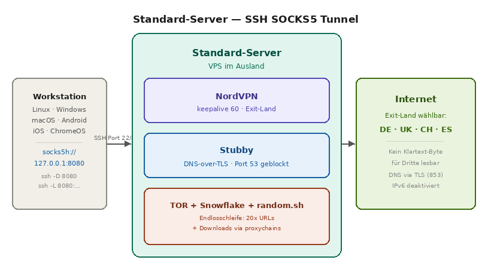
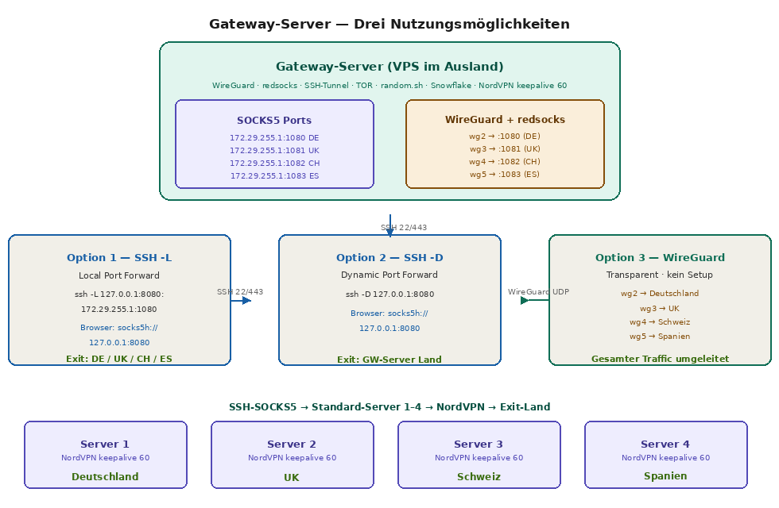
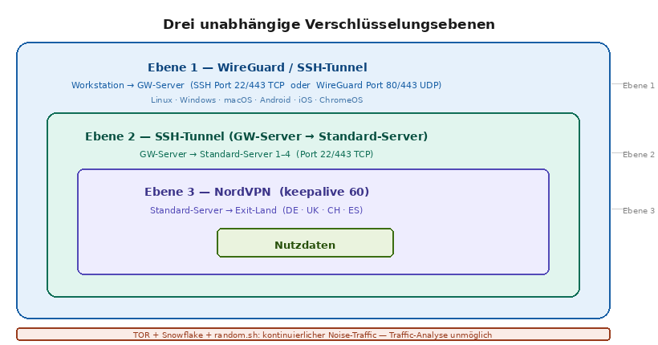
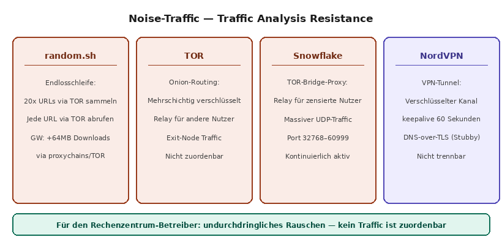

# debian-vpn-gateway

> Ein produktionsreifes, konfigurationsbasiertes Privacy-Framework für Debian 12 / 13 —  
> selbst betrieben, vollständig verschlüsselt, ohne Abhängigkeit von kommerziellen VPN-Anbietern.

---

## Inhalt

- [Warum ein eigener Server?](#warum-ein-eigener-server)
- [Architektur](#architektur)
- [Betriebsmodi](#betriebsmodi)
- [Sicherheitsmerkmale der Firewall](#sicherheitsmerkmale-der-firewall)
- [Voraussetzungen](#voraussetzungen)
- [Dokumentation](#dokumentation)
- [Entstehungsgeschichte](#entstehungsgeschichte)

---

## Warum ein eigener Server?

Kommerzielle VPN-Anbieter versprechen Anonymität — verlangen aber blindes Vertrauen in
eine Firma deren Geschäftsmodell auf der Verwaltung deiner Daten basiert. Avast wurde in
den USA zu einer Millionenstrafe verurteilt weil sie VPN-Kundendaten klammheimlich an
Werbenetzwerke verkauft hatten.

Ein selbst betriebener Server eliminiert dieses Vertrauensproblem vollständig:

- **Vollständige Kontrolle** — du weisst genau welche Software läuft und wer Zugriff hat
- **Keine Logs** — technische Garantie statt einer „No-Logs-Policy" der du vertrauen musst
- **Keine Datenweitergabe** — deine Daten bleiben unter deiner direkten Kontrolle
- **Geografische Flexibilität** — Exit-Land jederzeit durch eine Konfigurationszeile wechselbar
- **Kostenoptimierung** — günstiger VPS + NordVPN kostet weniger als ein Schweizer VPS allein

---

## Architektur

### Standard-Server — SOCKS5 über SSH

Jeder Standard-Server leitet den gesamten Traffic über NordVPN in ein definiertes
Exit-Land. Der Client verbindet sich via SSH Dynamic Port Forwarding und erhält
einen lokalen SOCKS5-Proxy-Port.



Die vollständige Verschlüsselungskette macht jeden Traffic für den Rechenzentrum-Betreiber
unlesbar: SSH-Tunnel auf Port 22 oder 443, DNS verschlüsselt via Stubby (DNS-over-TLS Port 853),
TOR und Snowflake erzeugen kontinuierlichen Noise-Traffic zur Obfuskation.

### Gateway-Modus — Transparenter Proxy für alle Endgeräte

Der Gateway-Modus macht komplexe Proxy-Konfigurationen für den Endnutzer unsichtbar.
Ein WireGuard-Profil importieren — und der gesamte Traffic läuft automatisch durch
die Infrastruktur, inklusive DNS-Schutz und Exit-Land-Auswahl. Drei unabhängige
Nutzungsmöglichkeiten stehen zur Verfügung: SSH Local Forward (`-L`), SSH Dynamic
Forward (`-D`) und WireGuard transparent.



### Drei unabhängige Verschlüsselungsebenen

Die Architektur schichtet drei voneinander unabhängige Verschlüsselungsprotokolle
übereinander. Kein einzelner Knoten in der Kette kennt das vollständige Bild.



### Noise-Traffic — Traffic Analysis Resistance

Vier unabhängige Quellen erzeugen kontinuierlichen Hintergrund-Traffic der eine
Traffic-Analyse durch Dritte unmöglich macht.



---

## Betriebsmodi

### Standard-Server (sample-cfg)

Vier unabhängige Server, jeder mit eigenem NordVPN Exit-Land:

| Server | Exit-Land | SOCKS5-Port lokal |
|--------|-----------|------------------|
| Server 1 | Deutschland | 1080 |
| Server 2 | United Kingdom | 1081 |
| Server 3 | Schweiz | 1082 |
| Server 4 | Spanien | 1083 |

Verbindung vom Client:

```bash
ssh -D 1080 -N socks@server1.example.com        # Port 22
ssh -D 1080 -N -p 443 socks@server1.example.com # falls Port 22 geblockt
```

Im Browser oder System:

```
socks5h://localhost:1080   # → Deutschland (socks5h: DNS-Auflösung remote → kein DNS-Leak)
socks5h://localhost:1081   # → UK
socks5h://localhost:1082   # → Schweiz
socks5h://localhost:1083   # → Spanien
```

> **Wichtig:** `socks5h` (mit `h`) verwenden — nicht `socks5`. Das `h` bedeutet dass die
> Hostname-Auflösung auf dem Remote-Server erfolgt. Mit `socks5` (ohne `h`) passiert DNS
> lokal beim Client → DNS-Leak. Da auf dem Server Port 53 in der Firewall vollständig
> geblockt ist, ist Klartext-DNS technisch unmöglich.

**Verbindungsnachweis via X11:**

```bash
ssh -X admin-user@server1.example.com xclock
```

Erscheint die `xclock` auf dem lokalen Desktop ist die Verbindung vollständig funktionsfähig.

### Gateway-Modus (sample-gw)

Der Gateway-Modus für Endnutzer ohne technisches Vorwissen:

```
1. WireGuard-App installieren (Windows / Linux / Android / iOS)
2. QR-Code scannen oder Config-Datei importieren
3. Fertig — gesamter Traffic läuft durch die Infrastruktur
```

Kein Proxy-Eintrag, kein DNS-Setup, keine Konfiguration auf dem Client-Gerät.
`redsocks` übernimmt die transparente TCP-Umleitung unsichtbar für das Gerät.

Umgeleitete Ports (Auswahl): HTTP (80), HTTPS (443), SMTP (25/465/587),
IMAP (143/993), DNS-over-TLS (853), WhatsApp (5222–5230), RDP (3389).

**Nutzung für versierte Benutzer:** Die vier SSH-SOCKS5-Verbindungen zu den
Standard-Servern sind bereits etabliert und können direkt genutzt werden —
ohne eigene SSH-Verbindung aufzubauen:

```
socks5h://localhost:1080  → Deutschland
socks5h://localhost:1081  → UK
socks5h://localhost:1082  → Schweiz
socks5h://localhost:1083  → Spanien
```

---

## Sicherheitsmerkmale der Firewall

Das Herzstück des Frameworks ist `firewall.sh` — entwickelt, getestet und
über mehrere Jahre in der Praxis verfeinert. Es hebt sich durch folgende
Merkmale von einer Standard-iptables-Konfiguration ab:

### Früherkennung ungültiger Pakete

Paket-Validierungsregeln in der `mangle/PREROUTING`-Kette statt in INPUT —
ungültige Pakete werden abgefangen bevor sie die eigentliche Verarbeitungslogik
des Kernels erreichen.

### 19 Bogus-TCP-Flag-Regeln

Umfassender Schutz gegen Techniken die von Port-Scannern wie `nmap` verwendet
werden: NULL-Scan, Xmas-Scan, SYN/FIN-Kombination, FIN ohne ACK, fragmentierte
Pakete und 14 weitere illegitime Flag-Kombinationen. Alle Regeln sind einzeln
mit `--comment` versehen und können via `fw_debug=yes` geloggt werden.

### SYN-Flood Schutz mit dynamischem Rate-Limiting

```bash
iptables -t mangle -A PREROUTING -p tcp --syn \
  -m hashlimit --hashlimit-above 20/sec --hashlimit-burst 30 \
  --hashlimit-mode srcip --hashlimit-name syn_flood -j DROP
```

Jede Source-IP wird auf maximal 20 neue SYN-Pakete pro Sekunde limitiert,
mit einem Burst von 30 Paketen — effektiver Schutz ohne Blockierung
legitimen Verkehrs.

### Vollständige ICMP-Kontrolle

Granulare Kontrolle aller 30 ICMP-Typen in INPUT und OUTPUT. Erlaubt ist
ausschliesslich was technisch notwendig ist. Verhindert ICMP-basierte
Reconnaissance (Typ 13, Typ 17) und ICMP-Redirect-Angriffe (Typ 5).

### DNS-Leak-Prevention auf mehreren Ebenen

- DNS-Anfragen der WireGuard-Clients werden aktiv auf den internen DNS-Server umgeleitet
- Alle ausgehenden DNS-Verbindungen über das externe Interface werden in FORWARD geblockt
- Stubby verschlüsselt alle DNS-Anfragen via DNS-over-TLS (Port 853)
- Port 53 (Klartext-DNS) ist vollständig geblockt — Klartext-DNS ist technisch unmöglich

### IPv6-Leak-Prevention

Der gesamte IPv6-Stack wird vollständig deaktiviert. Ein aktiver aber nicht
abgesicherter IPv6-Stack kann VPN-Tunnel umgehen und die echte IP-Adresse preisgeben.

### Konfigurationsbasierte Architektur

Alle Parameter werden über Dateien in `/etc/config/cfg/` gesteuert.
Ein Feature wird aktiviert indem die entsprechende Datei existiert —
und deaktiviert indem sie gelöscht wird:

```bash
touch /etc/config/cfg/swtor_tor    # TOR aktivieren
rm    /etc/config/cfg/swtor_tor    # TOR deaktivieren
```

Keine sensitiven Daten im Script selbst. Klare Trennung zwischen Logik
und Konfiguration. Über `custom_rules` können serverspezifische Regeln
hinzugefügt werden ohne das Hauptscript zu verändern.

### Übersicht Schutzmechanismen

| Mechanismus | Methode | Kette |
|---|---|---|
| Bogus TCP-Flags (19 Regeln) | mangle DROP | PREROUTING |
| SYN-Flood Schutz | hashlimit Rate-Limiting | PREROUTING |
| Ungültige Pakete | conntrack INVALID DROP | PREROUTING |
| Performance-Optimierung | ESTABLISHED/RELATED Vorfilter | PREROUTING |
| Fragmentierte Pakete | -f DROP | PREROUTING |
| ICMP-Vollkontrolle | Typen 0–30 explizit geregelt | INPUT / OUTPUT |
| DNS-Leak-Prevention | DNAT + FORWARD REJECT | PREROUTING / FORWARD |
| IPv6-Leak-Prevention | IPv6-Stack deaktiviert | Systemebene |
| Ausgehender Verkehr | OUTPUT-Kette detailliert | OUTPUT |
| Konfigurationsarchitektur | /etc/config/cfg Feature-Flags | Systemebene |

---


---

## Die Firewall — Das technische Herzstück

`firewall.sh` ist ein 1660-zeiliges iptables-Framework das weit über eine
Standard-Firewall-Konfiguration hinausgeht. Es vereint Paketfilterung,
VPN-Management, transparentes Proxying und DNS-Leak-Prevention in einem
einzigen, konfigurationsbasierten Script.

> ℹ️ **Grundprinzip:** Das Script ist vollständig idempotent — es kann jederzeit
> erneut ausgeführt werden und bringt die Firewall in einen definierten Zustand.
> Alle Parameter werden über Dateien in `/etc/config/cfg/` gesteuert.

---

### 1. Früherkennung ungültiger Pakete in der mangle/PREROUTING-Kette

**Das ist der erste und wichtigste Unterschied zu 99% aller online zu findenden
iptables-Konfigurationen.**

Ungültige und gefährliche Pakete werden in der `mangle/PREROUTING`-Kette
abgefangen — **bevor** sie die INPUT-Kette und damit die eigentliche
Kernel-Verarbeitungslogik erreichen. Das Script kommentiert dies explizit:

> *"Wer diese ungültigen Packete wie an so vielen Orten und Beispielen zu finden
> in der INPUT Kette platziert hat die fundamentalsten Grundprinzipien von
> iptables nicht wirklich verstanden!"*

**Performance-Optimierung:** ESTABLISHED/RELATED-Pakete werden als erstes
akzeptiert und durchlaufen keine weiteren Checks — das entlastet die
gesamte Kette erheblich:

```bash
iptables -t mangle -A PREROUTING \
  -m conntrack --ctstate ESTABLISHED,RELATED -j ACCEPT
```

---

### 2. Schutz vor gefälschten TCP-Flags (19 Regeln)

Umfassender Schutz gegen alle bekannten TCP-Flag-Manipulationstechniken.
Jede Regel ist mit einer eindeutigen Kommentar-ID versehen (`chain 01/01`
bis `chain 01/19`) und kann einzeln im Debug-Modus geloggt werden:

| Regel | Beschreibung | Angriffstechnik |
|-------|-------------|-----------------|
| 01/01 | MSS ausserhalb 536–65535 | Malformed SYN |
| 01/02 | INVALID conntrack state | Stateless Angriffe |
| 01/03 | NEW ohne SYN-Flag | Session-Hijacking |
| 01/04 | FIN+SYN+URG+NONE | NULL-Scan Variante |
| 01/05 | FIN+SYN | Xmas-Scan Variante |
| 01/06 | SYN+RST | Illegale Kombination |
| 01/07 | SYN+FIN | Xmas-Scan |
| 01/08 | FIN+RST | Illegale Kombination |
| 01/09 | FIN ohne ACK | FIN-Scan (nmap) |
| 01/10 | URG ohne ACK | URG-Scan |
| 01/11 | FIN ohne ACK | FIN-Scan Variante |
| 01/12 | PSH ohne ACK | PSH-Scan |
| 01/13 | ALL Flags gesetzt | Xmas-Scan (full) |
| 01/14 | NULL (keine Flags) | NULL-Scan |
| 01/15 | FIN+PSH+URG | Xmas-Scan Variante |
| 01/16 | SYN+FIN+PSH+URG | Xmas-Scan Variante |
| 01/17 | SYN+RST+ACK+FIN+URG | Illegale Kombination |
| 01/18 | Fragmentierte Pakete | Fragmentierungsangriffe |
| 01/19 | SYN-Flood (>20/sec/srcip) | DDoS SYN-Flood |

**SYN-Flood Schutz mit dynamischem Rate-Limiting:**
```bash
iptables -t mangle -A PREROUTING -p tcp --syn \
  -m hashlimit --hashlimit-above 20/sec --hashlimit-burst 30 \
  --hashlimit-mode srcip --hashlimit-name syn_flood -j DROP
```
Jede Source-IP wird individuell auf maximal 20 SYN/Sekunde limitiert —
legitimer Traffic bleibt ungestört.

---

### 3. Granulare ICMP-Vollkontrolle (alle 30 Typen)

Die meisten Firewalls erlauben oder blockieren ICMP pauschal. Dieses Script
kontrolliert alle 30 ICMP-Typen einzeln und explizit.

**INPUT:** Nur ICMP Echo-Reply (Typ 0) von bekannten Gegenstellen wird
akzeptiert — und nur wenn der Verbindungsstatus ESTABLISHED oder RELATED ist:

```bash
iptables -A INPUT -p icmp --icmp-type 0 \
  -s 0/0 -d $external_ip \
  -m state --state ESTABLISHED,RELATED -j ACCEPT
```

Alle anderen ICMP-Typen werden geblockt, darunter:
- Typ 5 (Redirect) — verhindert ICMP-Redirect-Angriffe
- Typ 13 (Timestamp) — verhindert Timestamp-basierte Reconnaissance
- Typ 17 (Address Mask) — verhindert Netzwerk-Enumeration

**OUTPUT:** Nur ICMP Echo (Typ 8) darf den Server verlassen — für Ping-Monitoring.
Alle anderen 29 Typen werden geblockt.

---

### 4. Mehrstufige DNS-Leak-Prevention

DNS-Leaks sind das häufigste Problem bei VPN-Konfigurationen. Dieses Script
verhindert sie auf drei unabhängigen Ebenen:

**Ebene 1 — Klartext-DNS in FORWARD komplett geblockt:**
```bash
iptables -A FORWARD -o $external_if -p tcp --dport 53 -j REJECT
iptables -A FORWARD -o $external_if -p udp --dport 53 -j REJECT
```
Kein WireGuard-Client kann jemals Klartext-DNS nach aussen senden.

**Ebene 2 — Aktive DNAT-Umleitung stray DNS-Anfragen:**
Wenn ein Client versucht einen anderen DNS-Server zu nutzen als den konfigurierten,
wird die Anfrage aktiv auf den internen DNS-Server umgeleitet und geloggt:
```bash
iptables -t nat -A PREROUTING \
  -m iprange --src-range $wireguard1_clients \
  -p udp --dport 53 -d 0.0.0.0 \
  -j LOG --log-prefix "WG0 OUTPUT DNS-TRAPPED UDP"

iptables -t nat -A PREROUTING \
  -m iprange --src-range $wireguard1_clients \
  -p udp --dport 53 -d 0.0.0.0 \
  -j DNAT --to-destination $wireguard1_dns:53
```

**Ebene 3 — Stubby DNS-over-TLS:**
Alle DNS-Anfragen die den Server verlassen sind zwingend via TLS verschlüsselt.
Port 53 (Klartext-DNS) ist im OUTPUT vollständig geblockt.

---

### 5. Transparente SOCKS5-Umleitung via DNAT (Gateway-Modus)

Die eleganteste Funktion des gesamten Frameworks. Der gesamte TCP-Traffic
der WireGuard-Clients wird via DNAT transparent auf den SOCKS5-Port
umgeleitet — ohne dass der Client etwas davon weiss:

```bash
# HTTP und HTTPS → redsocks → SOCKS5 → SSH-Tunnel → NordVPN → Zielland
iptables -t nat -A PREROUTING \
  -m iprange --src-range $wireguard1_clients \
  -p tcp --dport 80 \
  -j DNAT --to-destination $redirect01_wg0

iptables -t nat -A PREROUTING \
  -m iprange --src-range $wireguard1_clients \
  -p tcp --dport 443 \
  -j DNAT --to-destination $redirect01_wg0
```

**Intelligente Ausnahmen via RETURN:** SSH (Port 22) und TOR (Port 9050)
werden **nicht** umgeleitet — sie passieren direkt:

```bash
# SSH direkt durchreichen — kein Proxy
iptables -t nat -A PREROUTING \
  -m iprange --src-range $wireguard1_clients \
  -p tcp --dport 22 -j RETURN

# TOR direkt durchreichen
iptables -t nat -A PREROUTING \
  -m iprange --src-range $wireguard1_clients \
  -p tcp --dport $tor_port -j RETURN
```

Das Script erklärt es selbst:
> *"Wir wollen uns nicht selbst in den Fuss schiessen — SSH wird einfach
> durchgereicht. Ohne diese Regel müssten wir ständig das VPN deaktivieren
> um in Kontakt mit dem Server zu treten."*

---

### 6. Komplette Blockierung privater IP-Bereiche im FORWARD

WireGuard-Clients können nicht auf interne RFC1918-Netze zugreifen —
und erst recht nicht auf Loopback, APIPA oder Multicast:

```bash
# Loopback
iptables -A FORWARD -m iprange --src-range $wireguard1_clients \
  -d 127.0.0.0/8 -j REJECT
# APIPA (Link-Local)
iptables -A FORWARD -m iprange --src-range $wireguard1_clients \
  -d 169.254.0.0/16 -j REJECT
# Multicast
iptables -A FORWARD -m iprange --src-range $wireguard1_clients \
  -d 224.0.0.0/4 -j REJECT
# Reserved
iptables -A FORWARD -m iprange --src-range $wireguard1_clients \
  -d 240.0.0.0/4 -j REJECT
# RFC1918 Klasse A
iptables -A FORWARD -m iprange --src-range $wireguard1_clients \
  -d 10.0.0.0/8 -j REJECT
# RFC1918 Klasse B
iptables -A FORWARD -m iprange --src-range $wireguard1_clients \
  -d 172.16.0.0/12 -j REJECT
# RFC1918 Klasse C
iptables -A FORWARD -m iprange --src-range $wireguard1_clients \
  -d 192.168.0.0/16 -j REJECT
```

---

### 7. Traceroute-Blockierung

UDP-Traceroute-Anfragen (Port 33434–33474) werden in der INPUT-Kette
geblockt — der Server ist für externe Netzwerk-Mapping-Tools unsichtbar:

```bash
iptables -A INPUT -p udp --dport 33434:33474 -j REJECT
```

---

### 8. NordVPN-Kompatibilitätsmodus

NordVPN setzt beim Start eigene iptables-Regeln. Wenn der `nvpn`-Schalter
aktiv ist, werden die iptables-Tabellen beim Scriptstart **nicht** zurückgesetzt
— ein oft übersehenes Detail das bei naiver Implementierung zum vollständigen
Verlust der NordVPN-Routing-Regeln führt.

---

### 9. Debug-Modus mit individuellem Logging pro Regel

Jede einzelne der 19 Bogus-Flag-Regeln hat eine korrespondierende LOG-Regel
die via `fw_debug=yes` aktiviert wird:

```bash
if [ $fw_debug = "yes" ] ; then
    iptables -t mangle -A PREROUTING -p tcp --tcp-flags ALL NONE \
      -j LOG --log-prefix "chain01/14 "
fi
iptables -t mangle -A PREROUTING -p tcp --tcp-flags ALL NONE -j DROP \
  -m comment --comment "chain 01/14 block packets with bogus tcp flags"
```

Im Debug-Modus kann jeder Regeltyp einzeln in `/var/log/syslog` verfolgt werden:
```bash
fw_debug="yes"   # In firewall.sh aktivieren
tail -f /var/log/syslog | grep "chain01"
```

---

### 10. Selbstdokumentierender Code

Jede Regel trägt einen `--comment` mit einer eindeutigen ID. Das erlaubt
gezielte Abfragen der aktiven Regeln:

```bash
iptables -t mangle -L PREROUTING -n --line-numbers | grep "chain 01"
```

Ausgabe:
```
1   DROP  tcp  -- anywhere  anywhere  tcp NEW tcpmss ! 536:65535  /* chain 01/01 block uncommon mss values */
2   DROP  all  -- anywhere  anywhere  ctstate INVALID  /* chain 01/02 block invalid packets */
3   DROP  tcp  -- anywhere  anywhere  tcp ! flags:0x17/0x02  /* chain 01/03 block not-syn flag marked packets */
...
```

---

### Zusammenfassung der Schutzschichten

| Schicht | Technik | Kette | Besonderheit |
|---------|---------|-------|-------------|
| Paket-Vorfilter | ESTABLISHED/RELATED Accept | mangle/PREROUTING | Performance-Optimierung |
| Bogus TCP-Flags | 19 individuelle DROP-Regeln | mangle/PREROUTING | Richtige Kette — nicht INPUT! |
| SYN-Flood | hashlimit pro Source-IP | mangle/PREROUTING | 20/sec Limit mit Burst 30 |
| Fragmentierung | -f DROP | mangle/PREROUTING | Fragmentierungsangriffe |
| ICMP-Kontrolle | Alle 30 Typen einzeln | INPUT + OUTPUT | Kein pauschales ACCEPT/DROP |
| DNS-Leak | FORWARD REJECT + DNAT | FORWARD + nat/PREROUTING | Aktive Umleitung stray DNS |
| Traceroute | UDP 33434–33474 | INPUT | Server unsichtbar für Mapping |
| Transparentes Proxy | DNAT → redsocks | nat/PREROUTING | SOCKS5 ohne Client-Konfiguration |
| RFC1918-Schutz | 7 REJECT-Regeln | FORWARD | Loopback, APIPA, Multicast, privat |
| NordVPN-Compat. | Kein Table-Flush | Systemebene | Erhalt der NordVPN-Routing-Regeln |
| Debug-Modus | LOG pro Regel | Alle Ketten | Granulare Fehlersuche |
| Dokumentation | `--comment` pro Regel | Alle Ketten | Selbstdokumentierender Code |

## Voraussetzungen

### VPS-Mindestanforderungen

| Ressource | Minimum | Empfohlen |
|-----------|---------|-----------|
| CPU | 1 Core / 1.6 GHz | 2 Cores |
| RAM | 1 GB | 2 GB |
| Storage | 20 GB SSD | 20 GB SSD |
| Netzwerk | 1 Gbit/s | 1 Gbit/s |
| Datenvolumen | 2 TB/Monat | 4 TB/Monat |
| Betriebssystem | Debian 12 | Debian 13 |

> **Wichtig:** Konsolenzugriff (KVM/VNC) ist unverzichtbar. Solltest du dich durch
> eine fehlerhafte Firewall-Konfiguration aussperren, ermöglicht der Konsolenzugriff
> die Fehlerbehebung direkt am virtuellen Bildschirm des Servers.

### Erforderliche Software

**Standard-Server:**
```bash
apt install wireguard wireguard-tools stubby tor proxychains \
            curl sshpass openssh-server
# NordVPN:
cd /etc/config && ./get-nordvpn.sh
```

**Gateway-Server:**
```bash
apt install redsocks proxychains wireguard wireguard-tools \
            stubby tor curl sshpass openssh-server
```

### Strategische Wahl des Server-Standorts

Für maximale Privatsphäre einen Rechtsraum wählen der nicht dem eigenen
Wohnsitzland unterliegt und idealerweise strengere Datenschutzgesetze bietet:

- **Schweizer Nutzer:** Server in Deutschland oder UK (ausserhalb Schweizer Rechtsprechung)
- **Deutsche Nutzer:** Server in der Schweiz, Island oder Tschechien
- **Allgemein:** Tschechien bietet günstige Preise (~2.50 EUR/Monat) und ist
  nicht Mitglied der Five-Eyes-Allianz

### Kosten-Nutzen-Vergleich

| Variante | Monatliche Kosten | Flexibilität |
|----------|------------------|-------------|
| Schweizer VPS direkt | ~15–20 EUR | Fix — ein Land |
| Günstiger VPS + NordVPN | ~7–9 EUR | Beliebig wechselbar |
| 4 VPS + 1 GW-Server (OpenStack) | ~16 EUR | 4 Länder gleichzeitig |

---

## Dokumentation

| Dokument | Inhalt |
|----------|--------|
| [CONFIGURATION.md](CONFIGURATION.md) | Vollständige Parameter-Dokumentation aller cfg-Schalter |
| [INSTALL.md](INSTALL.md) | Schritt-für-Schritt Installationsanleitung |
| [etc/config/sample-cfg/](etc/config/sample-cfg/) | Beispielkonfiguration Standard-Server |
| [etc/config/sample-gw/](etc/config/sample-gw/) | Beispielkonfiguration Gateway-Server |
| [etc/config/sample-config/](etc/config/sample-config/) | Beispiele für sshd_config, stubby, redsocks, proxychains |
| [etc/config/doc/changes](etc/config/doc/changes) | Vollständiges Änderungsprotokoll seit 2024 |

---

## Entstehungsgeschichte

Diese Scriptsammlung entstand aus einer ungewöhnlichen Situation: Ein ehemaliger
Kunde weigerte sich vehement seine über zwölf Jahre im Einsatz befindliche Firewall
(Zyxel USG 100) auszutauschen. Um moderne VPN-Verbindungen (IKEv2/IPsec und WireGuard)
auf der betagten Hardware zu realisieren, war es nötig tief in die Materie einzutauchen
und masgeschneiderte Scripte zu entwickeln.

Was als kreative Problemlösung begann wurde über mehrere Jahre zu einem vollständigen
Privacy-Framework weiterentwickelt — getestet auf realen Servern, verfeinert durch
echte Betriebserfahrung und dokumentiert mit dem Anspruch das beste zu bieten
was als Privatperson technisch möglich ist.

> *Ein selbst gehostetes VPN verwandelt das Versprechen der digitalen Privatsphäre
> in eine überprüfbare Realität.*

---

*github.com/debian-professional/debian-vpn-gateway*


